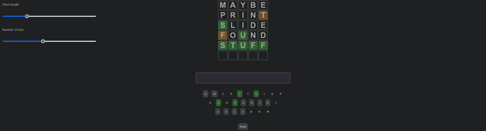
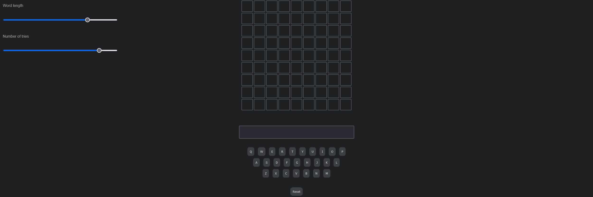

<!--suppress ALL, HtmlUnknownAnchorTarget -->

[//]: # (Find and replace Wordle_clone with the name of your repo)

<a id="readme-top"></a>

[![Contributors][contributors-shield]][contributors-url]
[![Forks][forks-shield]][forks-url]
[![Stargazers][stars-shield]][stars-url]
[![Issues][issues-shield]][issues-url]
[![MIT License][license-shield]][license-url]

<h3 align="center">Wordle clone</h3>


<div align="center">
  <p>
    A pure js app that reproduce the wordle game 
    <br />
    <a href="https://github.com/Gabann/Wordle_clone/tree/main/documentation"><strong>Explore the docs »</strong></a>
    <br />
    <a href="https://github.com/gabann/Wordle_clone/issues">Report Bug</a>
    ·
    <a href="https://github.com/gabann/Wordle_clone/issues">Request Feature</a>
  </p>
</div>


<!-- TABLE OF CONTENTS -->
<details>
  <summary>Table of Contents</summary>
  <ol>
    <li>
      <a href="#about-the-project">About The Project</a>
      <ul>
        <li><a href="#built-with">Built With</a></li>
      </ul>
    </li>
    <li>
      <a href="#getting-started">Getting Started</a>
      <ul>
        <li><a href="#prerequisites">Prerequisites</a></li>
        <li><a href="#installation">Installation</a></li>
      </ul>
    </li>
    <li><a href="#usage">Usage</a></li>
    <li><a href="#preview">Preview</a></li>
    <li><a href="#contributing">Contributing</a></li>
    <li><a href="#license">License</a></li>
    <li><a href="#contact">Contact</a></li>
  </ol>
</details>

<!-- ABOUT THE PROJECT -->

## About the Project

This is my very first project in js.

I wanted to reproduce the wordle game to practice js and css

### Features

- Random word generation
- Variable word length
- Variable number of tries

### Built With

[![Javascript][javascript-badge]][javascript-url]
[![HTML][html-badge]][html-url]
[![CSS][css-badge]][css-url]

<div align="right"><a href="#readme-top">back to top</a></div>


<!-- GETTING STARTED -->

## Getting Started

### Prerequisites

This app is built in pure js and does not require anything to be ran

### Installation

```bash
git clone https://github.com/Gabann/Wordle_clone
```

<!-- USAGE EXAMPLES -->

## Usage

Run index.html in your browser

<div align="right"><a href="#readme-top">back to top</a></div>

<!-- PREVIEW -->

## Preview

<div style="display: flex; flex-wrap: wrap; justify-content: space-around;">
  
  
</div>

<div align="right"><a href="#readme-top">back to top</a></div>


<!-- CONTRIBUTING -->

## Contributing

We welcome contributions from everyone! Follow these steps to contribute:

1. **Fork** the repository.
2. **Clone** the forked repository to your local machine.
3. **Create a new branch** for your contribution.
4. **Make your changes** and **commit** them.
5. **Push** your changes to your forked repository.
6. **Open a pull request** to the main project repository.

### Contribution Guidelines

- Discuss significant changes by opening an issue first.
- Follow the existing code style and structure.
- Write clear commit messages and document your code.
- Ensure changes don't break existing functionality.
- Update documentation if necessary.

<div align="right"><a href="#readme-top">back to top</a></div>


<!-- LICENSE -->

## License

Distributed under the 'LICENSE' License. See [`LICENSE`](https://github.com/Gabann/Wordle_clone/blob/main/LICENSE) for more information.

<div align="right"><a href="#readme-top">back to top</a></div>


<!-- CONTACT -->

## Contact

- [![Twitter][gmail-shield]][gmail-url]
- [![LinkedIn][linkedin-shield]][linkedin-url]
- [![Twitter][twitter-shield]][twitter-url]

<div align="right"><a href="#readme-top">back to top</a></div>


---------------------------------------------------------------

[repo-link]: https://github.com/Gabann/Wordle_clone

[contributors-shield]: https://img.shields.io/github/contributors/gabann/Wordle_clone.svg?style=for-the-badge

[contributors-url]: https://github.com/gabann/Wordle_clone/graphs/contributors

[forks-shield]: https://img.shields.io/github/forks/gabann/Wordle_clone.svg?style=for-the-badge

[forks-url]: https://github.com/gabann/Wordle_clone/network/members

[stars-shield]: https://img.shields.io/github/stars/gabann/Wordle_clone.svg?style=for-the-badge

[stars-url]: https://github.com/gabann/Wordle_clone/stargazers

[issues-shield]: https://img.shields.io/github/issues/gabann/Wordle_clone.svg?style=for-the-badge

[issues-url]: https://github.com/gabann/Wordle_clone/issues

[license-shield]: https://img.shields.io/github/license/gabann/Wordle_clone.svg?style=for-the-badge

[license-url]: https://github.com/gabann/Wordle_clone/blob/master/LICENSE

[linkedin-shield]: https://img.shields.io/badge/-LinkedIn-black.svg?style=for-the-badge&logo=linkedin&colorB=555

[linkedin-url]: https://linkedin.com/in/gabin-deboulogne/

[twitter-shield]: https://img.shields.io/badge/Twitter-1DA1F2?style=for-the-badge&logo=twitter&logoColor=white

[twitter-url]: https://twitter.com/gabandev

[gmail-shield]: https://img.shields.io/badge/Gmail-EA4335.svg?style=for-the-badge&logo=Gmail&logoColor=white

[gmail-url]: mailto:gabin.deboulogne@gmail.com

[javascript-badge]: https://img.shields.io/badge/-JavaScript-black?style=for-the-badge&logo=javascript

[javascript-url]: https://developer.mozilla.org/en-US/docs/Web/JavaScript

[html-badge]: https://img.shields.io/badge/-HTML-black?style=for-the-badge&logo=html5

[html-url]: https://developer.mozilla.org/en-US/docs/Web/HTML

[css-badge]: https://img.shields.io/badge/-CSS-black?style=for-the-badge&logo=css3

[css-url]: https://developer.mozilla.org/en-US/docs/Web/CSS
